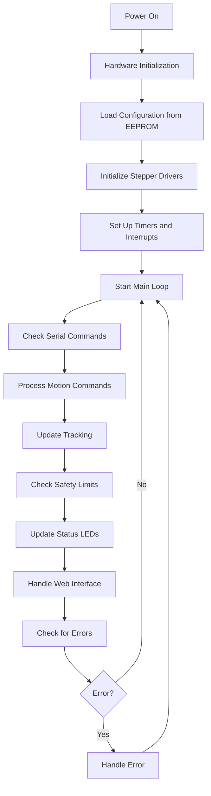
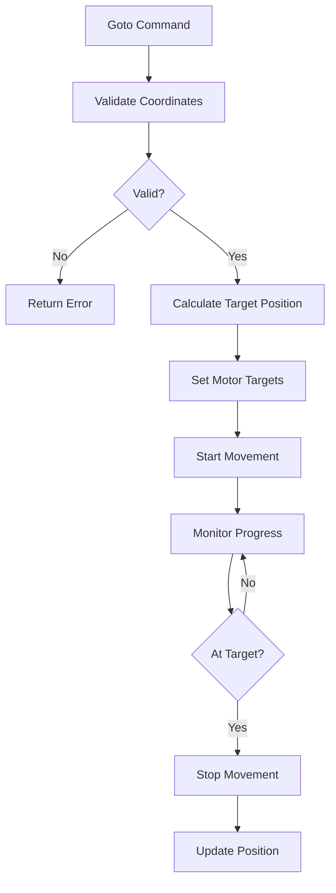
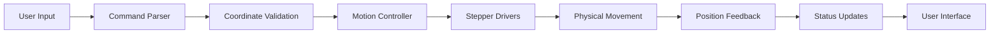
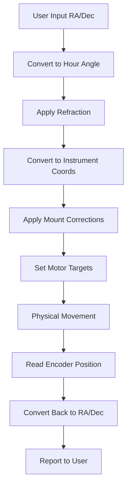
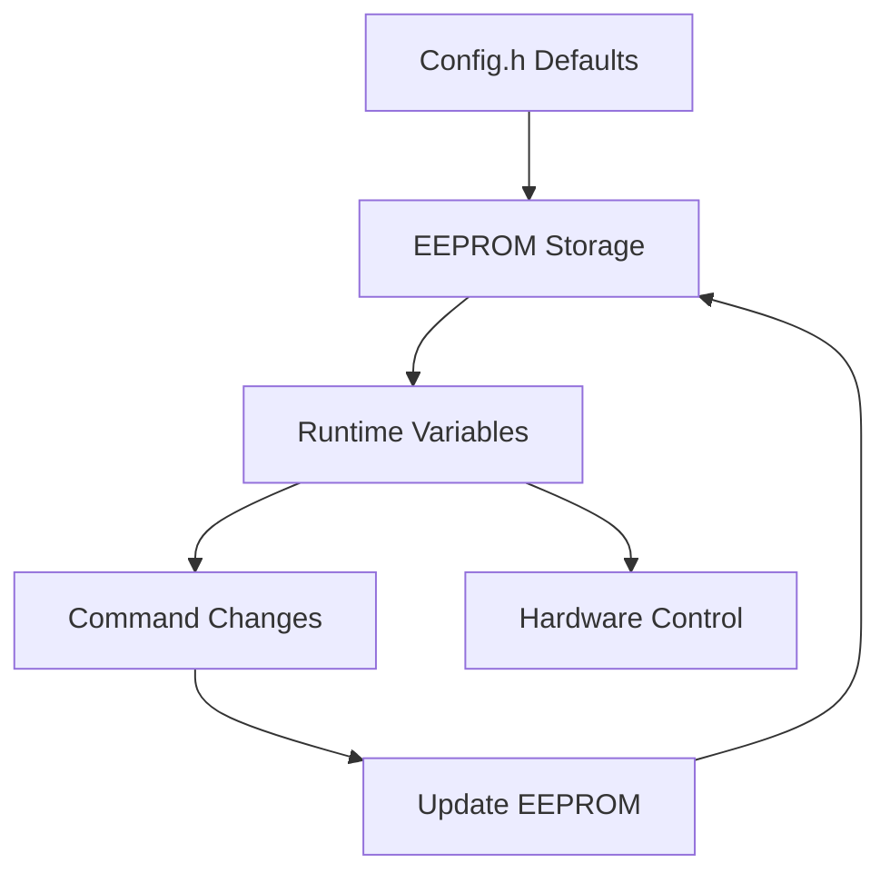
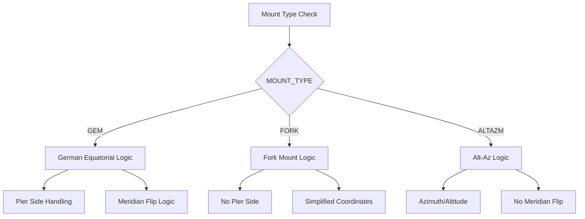

# OnStep Architecture Documentation

## Overview
OnStep is a telescope mount control system that runs on microcontrollers (Arduino, ESP32, etc.). This document explains the code structure, data flow, and key components to help developers understand and modify the system.

## Table of Contents
1. [System Architecture](#system-architecture)
2. [Main Program Flow](#main-program-flow)
3. [Key Components](#key-components)
4. [Data Flow Diagrams](#data-flow-diagrams)
5. [Configuration System](#configuration-system)
6. [Mount Type Handling](#mount-type-handling)
7. [Coordinate Systems](#coordinate-systems)
8. [Communication Protocols](#communication-protocols)
9. [File Organization](#file-organization)
10. [Common Modification Points](#common-modification-points)

## System Architecture

OnStep follows a modular architecture with these main layers:

```
┌─────────────────────────────────────────────────────────────┐
│                    Application Layer                         │
│  ┌─────────────┐ ┌─────────────┐ ┌─────────────┐          │
│  │   Goto      │ │   Park      │ │   Guide     │          │
│  │   Control   │ │   Control   │ │   Control   │          │
│  └─────────────┘ └─────────────┘ └─────────────┘          │
└─────────────────────────────────────────────────────────────┘
┌─────────────────────────────────────────────────────────────┐
│                    Command Layer                            │
│  ┌─────────────┐ ┌─────────────┐ ┌─────────────┐          │
│  │   Serial    │ │   Web        │ │   Hand      │          │
│  │   Commands  │ │   Interface  │ │   Controller│          │
│  └─────────────┘ └─────────────┘ └─────────────┘          │
└─────────────────────────────────────────────────────────────┘
┌─────────────────────────────────────────────────────────────┐
│                    Control Layer                            │
│  ┌─────────────┐ ┌─────────────┐ ┌─────────────┐          │
│  │   Motion    │ │   Tracking   │ │   Safety    │          │
│  │   Control   │ │   Control    │ │   Limits    │          │
│  └─────────────┘ └─────────────┘ └─────────────┘          │
└─────────────────────────────────────────────────────────────┘
┌─────────────────────────────────────────────────────────────┐
│                    Hardware Layer                           │
│  ┌─────────────┐ ┌─────────────┐ ┌─────────────┐          │
│  │   Stepper   │ │   Sensors    │ │   EEPROM    │          │
│  │   Drivers   │ │   (GPS,etc)  │ │   Storage   │          │
│  └─────────────┘ └─────────────┘ └─────────────┘          │
└─────────────────────────────────────────────────────────────┘
```

## Main Program Flow

The main program follows this flow:



### Detailed Main Loop Breakdown

1. **Hardware Initialization** (`OnStep.ino` - `setup()`)
   - Initialize pins and hardware
   - Load configuration from EEPROM
   - Set up stepper drivers
   - Initialize timers for tracking

2. **Main Loop** (`OnStep.ino` - `loop()`)
   - Runs continuously at high frequency
   - Handles all real-time operations
   - Processes commands and updates tracking

## Key Components

### 1. Configuration System (`Config.h`)

The configuration system is the heart of OnStep customization:

```c
// Mount type determines coordinate system behavior
#define MOUNT_TYPE                   FORK // GEM, FORK, or ALTAZM

// Stepper motor configuration
#define AXIS1_STEPS_PER_DEGREE    3200.0 // RA axis steps per degree
#define AXIS2_STEPS_PER_DEGREE    1920.0 // Dec axis steps per degree

// Driver settings
#define AXIS1_DRIVER_MODEL            OFF // Stepper driver type
#define AXIS1_DRIVER_MICROSTEPS       OFF // Microstep setting
```

**Why this matters**: Every mount is different. These settings tell OnStep how your specific hardware works.

### 2. Coordinate System (`src/lib/Coord.h`)

Handles all coordinate transformations between different coordinate systems:

```c
// Get current instrument coordinates
double getInstrAxis1(); // Returns RA/Azimuth position
double getInstrAxis2(); // Returns Dec/Altitude position

// Set target coordinates
void setIndexAxis1(double axis1, int newPierSide);
void setIndexAxis2(double axis2, int newPierSide);
```

**Key Concept**: OnStep works in "instrument coordinates" (what the mount thinks) and converts to/from "sky coordinates" (what astronomers use).

### 3. Motion Control (`MoveTo.ino`)

Controls all telescope movement:



### 4. Command Processing (`Command.ino`)

Handles all incoming commands from serial, web, or hand controller:

```c
// Example command processing
if (command[0] == 'G') {
    // Get commands (like :GR# for get RA)
    if (command[1] == 'R') {
        // Return current RA
    }
}
```

**Command Format**: All commands follow LX200 protocol:
- `:GR#` - Get current RA
- `:GD#` - Get current Dec  
- `:MS#` - Move to target
- `:ST1#` - Start tracking

## Data Flow Diagrams

### Complete System Data Flow



### Coordinate Transformation Flow



## Configuration System

### How Configuration Works

1. **Compile Time**: `Config.h` defines default values
2. **Runtime**: Values can be changed via commands and stored in EEPROM
3. **Persistence**: Settings survive power cycles



### Key Configuration Categories

1. **Mount Type** (`MOUNT_TYPE`)
   - `GEM` - German Equatorial Mount
   - `FORK` - Fork Mount  
   - `ALTAZM` - Altitude-Azimuth Mount

2. **Stepper Settings**
   - Steps per degree
   - Microstep settings
   - Driver configuration

3. **Safety Limits**
   - Altitude limits
   - Axis limits
   - Meridian limits

## Mount Type Handling

Different mount types require different coordinate handling:



### Fork Mount Specific Logic

Fork mounts have simplified coordinate handling:

```c
#if MOUNT_TYPE == FORK
    // No pier side concept
    thisPierSide = PierSideNone;
    // Direct coordinate mapping
    Axis1 = targetRA;
    Axis2 = targetDec;
#else
    // GEM mount logic with pier sides
    if (newPierSide == PierSideWest) axis1 = axis1 + 180.0;
#endif
```

## Coordinate Systems

OnStep handles multiple coordinate systems:

### 1. Sky Coordinates (What Astronomers Use)
- **RA (Right Ascension)**: 0-24 hours
- **Dec (Declination)**: -90° to +90°

### 2. Instrument Coordinates (What the Mount Uses)
- **Axis1**: RA or Azimuth position
- **Axis2**: Dec or Altitude position

### 3. Motor Coordinates (What the Motors See)
- **Steps**: Raw stepper motor steps
- **Microsteps**: Sub-step positioning


## Communication Protocols

### Serial Commands (LX200 Protocol)

```c
// Get commands
:GR#     // Get RA
:GD#     // Get Dec
:GU#     // Get status

// Set commands  
:Sr12:30:00#  // Set target RA
:Sd+45:00:00# // Set target Dec
:MS#          // Move to target
```

### Web Interface

- **Configuration**: `/configuration.htm`
- **Status**: Real-time updates via AJAX
- **Control**: Web-based telescope control

### Hand Controller

- **Menu System**: Hierarchical menu navigation
- **Real-time Control**: Direct mount control
- **Status Display**: Current position and status

## File Organization

### Core Files

```
OnStep.ino              # Main program entry point
Config.h                # Configuration settings
Globals.h               # Global variables and structures
Command.ino             # Command processing
MoveTo.ino              # Motion control
Goto.ino                # Goto functionality
Park.ino                # Parking control
```

### Library Files

```
src/lib/
├── Coord.h             # Coordinate transformations
├── Misc.h              # Utility functions
└── Rotator.h           # Rotator control
```

### Hardware Abstraction

```
src/HAL/                # Hardware abstraction layer
├── HAL.h               # Hardware definitions
├── HAL_*.h             # Platform-specific code
└── Pins_*.h            # Pin definitions
```

### Add-ons

```
addons/
├── Ethernet/           # Ethernet interface
├── WiFi/              # WiFi interface
└── SmartHandController/ # Hand controller
```

## Common Modification Points

### 1. Adding New Commands

**File**: `Command.ino`
**Location**: Add new command handlers in the main command processing section

```c
// Example: Add new command :GX#
if (command[0] == 'G' && command[1] == 'X') {
    // Your new command logic here
    sprintf(reply, "New command response");
    boolReply = false;
}
```

### 2. Modifying Coordinate Handling

**File**: `src/lib/Coord.h`
**Location**: Functions like `getInstrAxis1()`, `setIndexAxis1()`

```c
// Example: Add custom coordinate transformation
double getInstrAxis1() {
    // Your custom logic here
    return calculatedPosition;
}
```

### 3. Adding New Mount Types

**File**: `Config.h` and throughout codebase
**Location**: Add new `#define MOUNT_TYPE` option

```c
// In Config.h
#define MOUNT_TYPE YOUR_NEW_TYPE

// In code files
#if MOUNT_TYPE == YOUR_NEW_TYPE
    // Your mount-specific logic
#endif
```

### 4. Modifying Safety Limits

**File**: `OnStep.ino` (main loop safety checks)
**Location**: Look for `safetyLimitsOn` checks

```c
if (safetyLimitsOn) {
    // Add your custom safety checks here
    if (yourCustomCondition) {
        stopSlewingAndTracking(SS_LIMIT);
    }
}
```

### 5. Adding New Hardware Support

**File**: `src/HAL/HAL.h` and `src/pinmaps/`
**Location**: Add new pin definitions and hardware support

```c
// In HAL.h
#define YOUR_NEW_PIN 12

// In Pins_YourBoard.h
#define YourNewPin 12
```

## Debugging Tips

### 1. Enable Debug Output

```c
// In Config.h or relevant files
#define DEBUG_ONSTEP 1

// Use debug macros
DF("Debug message: %d\n", value);
```

### 2. Check Serial Output

- Connect serial monitor to see debug messages
- Look for error messages and status updates
- Monitor command processing

### 3. Common Issues

1. **Mount won't move**: Check stepper driver configuration
2. **Wrong coordinates**: Verify steps per degree settings
3. **Parking fails**: Check pier side logic for your mount type
4. **Tracking issues**: Verify sidereal rate calculations

## Testing Your Changes

### 1. Compile Test
```bash
# Make sure your changes compile without errors
# Check for warnings that might indicate issues
```

### 2. Hardware Test
- Start with small movements
- Test parking/unparking
- Verify coordinate accuracy
- Check safety limits

### 3. Integration Test
- Test with ASCOM drivers
- Verify web interface
- Check hand controller functionality

## Conclusion

This architecture documentation provides a comprehensive guide to understanding and modifying OnStep. The key is to understand the coordinate system flow and how different mount types are handled. Always test changes thoroughly and consider the impact on different mount types.

For specific modifications, refer to the relevant files mentioned in this document and use the debugging tips to troubleshoot any issues.
