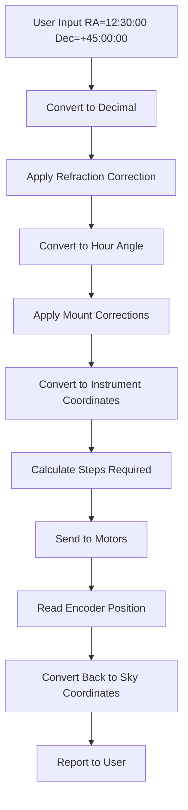
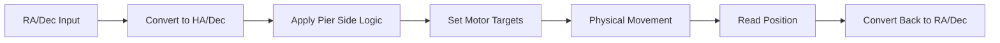
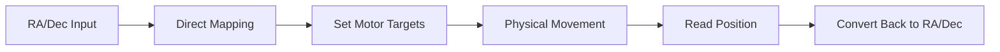
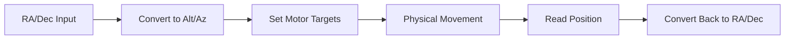

# OnStep Coordinate Systems Guide

## Overview
OnStep handles multiple coordinate systems to translate between what astronomers see in the sky and what the mount hardware can do. Understanding these systems is crucial for making modifications.

## Coordinate System Types

### 1. Sky Coordinates (Astronomical)
What astronomers use to describe object positions:

- **RA (Right Ascension)**: 0-24 hours (or 0-360°)
- **Dec (Declination)**: -90° to +90°
- **Alt (Altitude)**: -90° to +90° (horizon to zenith)
- **Az (Azimuth)**: 0-360° (north to east)

### 2. Instrument Coordinates (Mount Internal)
What the mount uses internally:

- **Axis1**: RA or Azimuth position in degrees
- **Axis2**: Dec or Altitude position in degrees
- **Pier Side**: Which side of the pier (GEM mounts only)

### 3. Motor Coordinates (Hardware)
What the stepper motors actually do:

- **Steps**: Raw stepper motor step counts
- **Microsteps**: Sub-step positioning
- **Position**: Current motor position

## Coordinate Transformation Flow



## Mount Type Differences

### German Equatorial Mount (GEM)


**Key Features:**
- Pier side handling (East/West)
- Meridian flip capability
- Complex coordinate transformations

### Fork Mount


**Key Features:**
- Simplified coordinate handling
- No pier side concept
- Direct RA/Dec to motor mapping

### Altitude-Azimuth Mount


**Key Features:**
- Alt/Az coordinate system
- No meridian flip
- Different limit handling

## Key Functions and Files

### Coordinate Conversion Functions

**File**: `src/lib/Coord.h`

```c
// Get current instrument coordinates
double getInstrAxis1();  // Returns RA/Azimuth
double getInstrAxis2();  // Returns Dec/Altitude

// Set target coordinates
void setIndexAxis1(double axis1, int newPierSide);
void setIndexAxis2(double axis2, int newPierSide);

// Get pier side (GEM mounts only)
int getInstrPierSide();
```

### Coordinate Transformation Functions

**File**: `Astro.ino`

```c
// Convert between coordinate systems
void equToHor(double HA, double Dec, double *Alt, double *Azm);
void horToEqu(double Alt, double Azm, double *HA, double *Dec);
void equToInstr(double HA, double Dec, double *Axis1, double *Axis2, int PierSide);
void instrToEqu(double Axis1, double Axis2, double *HA, double *Dec, int PierSide);
```

## Step Calculation

### How Steps Are Calculated

```c
// Basic formula
steps = (degrees * stepsPerDegree) + currentPosition

// Example for RA axis
double targetRA = 12.5;  // 12.5 hours
double targetDegrees = targetRA * 15.0;  // Convert to degrees
long targetSteps = (long)(targetDegrees * AXIS1_STEPS_PER_DEGREE);
```

### Microstep Handling

```c
// Microsteps affect resolution
double actualSteps = steps / microstepSetting;

// Example: 3200 steps/degree with 64 microsteps
// = 50 full steps per degree
// = 3200 microsteps per degree
```

## Common Coordinate Issues

### 1. Wrong Movement Direction
**Cause**: Steps per degree or microstep settings incorrect
**Fix**: Recalibrate using plate solving or known star positions

### 2. Coordinate Wrapping
**Cause**: Improper handling of 0°/360° boundary
**Fix**: Use proper range functions like `haRange()`, `degRange()`

### 3. Pier Side Confusion (GEM mounts)
**Cause**: Incorrect pier side logic
**Fix**: Verify pier side detection and handling

### 4. Altitude Limit Issues
**Cause**: Hardcoded limits overriding configuration
**Fix**: Use `ASCOM_LIMITS_OVERRIDE` flag

## Debugging Coordinate Issues

### 1. Enable Debug Output
```c
// Add debug prints to coordinate functions
DF("Current RA: %.2f, Target RA: %.2f\n", currentRA, targetRA);
DF("Axis1 steps: %ld, Target steps: %ld\n", currentSteps, targetSteps);
```

### 2. Check Coordinate Flow
```c
// Trace coordinate transformations
DF("Input: RA=%.2f, Dec=%.2f\n", inputRA, inputDec);
DF("After conversion: Axis1=%.2f, Axis2=%.2f\n", axis1, axis2);
DF("Steps: %ld, %ld\n", steps1, steps2);
```

### 3. Verify Mount Type Logic
```c
// Check mount type handling
#if MOUNT_TYPE == FORK
    DF("Fork mount logic\n");
#elif MOUNT_TYPE == GEM
    DF("GEM mount logic\n");
#endif
```

## Testing Coordinate Accuracy

### 1. Plate Solving Method
1. Point at known star
2. Plate solve to get exact coordinates
3. Command goto to same coordinates
4. Plate solve again to check accuracy

### 2. Star Drift Method
1. Point at bright star
2. Start tracking
3. Monitor for drift over time
4. Adjust steps per degree if needed

### 3. Manual Verification
1. Use known star positions
2. Command goto to exact coordinates
3. Check if star is centered
4. Adjust as needed

## Common Modifications

### 1. Adding New Coordinate System
```c
// In Coord.h
double getInstrAxis3();  // New axis
void setIndexAxis3(double axis3, int newPierSide);

// In coordinate functions
void equToInstr(double HA, double Dec, double *Axis1, double *Axis2, double *Axis3, int PierSide);
```

### 2. Modifying Step Calculations
```c
// Custom step calculation
long calculateSteps(double degrees, double stepsPerDegree, double correctionFactor) {
    return (long)(degrees * stepsPerDegree * correctionFactor);
}
```

### 3. Adding Coordinate Corrections
```c
// Apply custom corrections
double applyCorrection(double coordinate, double correction) {
    return coordinate + correction;
}
```

## Best Practices

### 1. Always Use Conditional Compilation
```c
#if MOUNT_TYPE == FORK
    // Fork mount specific code
#elif MOUNT_TYPE == GEM
    // GEM mount specific code
#endif
```

### 2. Validate Input Coordinates
```c
// Check coordinate ranges
if (ra < 0 || ra > 24) return CE_PARAM_RANGE;
if (dec < -90 || dec > 90) return CE_PARAM_RANGE;
```

### 3. Handle Edge Cases
```c
// Handle coordinate wrapping
while (coordinate >= 360.0) coordinate -= 360.0;
while (coordinate < 0.0) coordinate += 360.0;
```

### 4. Use Consistent Units
- Always convert to degrees for internal calculations
- Use radians for trigonometric functions
- Convert back to appropriate units for output

## Conclusion

Understanding OnStep's coordinate systems is essential for making modifications. The key is to trace the coordinate flow from user input through transformations to motor control and back to user output. Always test changes thoroughly and consider the impact on different mount types.
